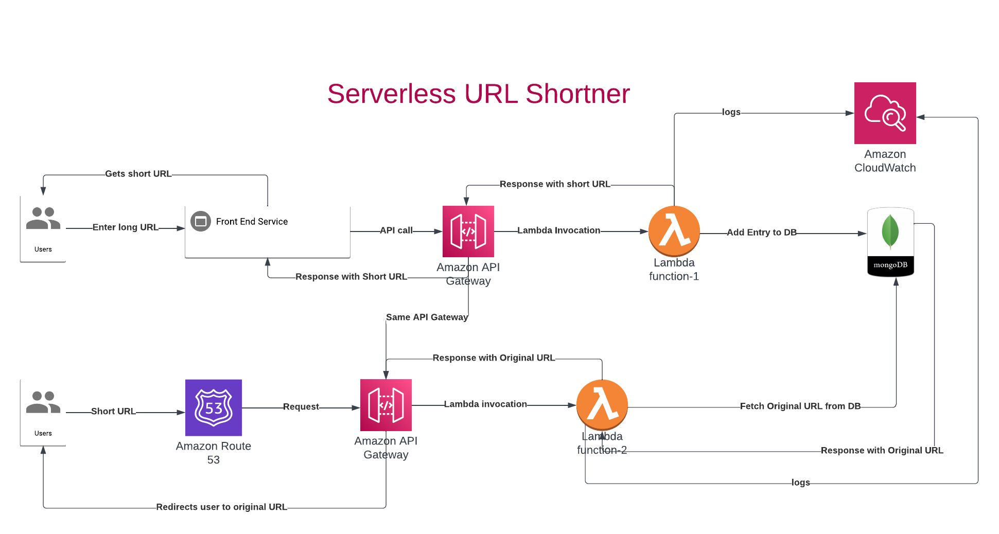

# TinyZr URL Shortener

TinyZR is a Serverless URL shortener project built with Python.

## Architecture

The architecture of the URL Shortener project is shown in the image above. It consists of a serverless infrastructure built with Python. The main components include a front-end web interface, a URL shortening service, and a database to store the shortened URLs and their corresponding original URLs.

## Features

- Shorten long URLs to a shorter format
- Redirect users to the original URL when they visit the shortened link
- Visit [urlshortener.tinyzr.link](https://urlshortener.tinyzr.link) to use the URL shortener

## Contributing

Contributions are welcome! If you find any issues or have suggestions for improvements, please open an issue or submit a pull request.
